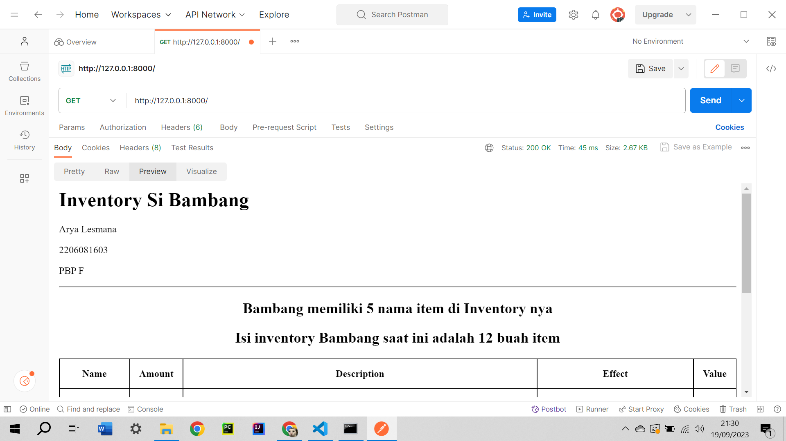
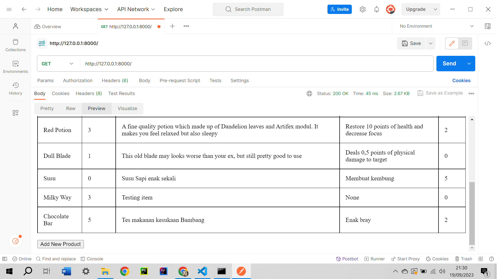
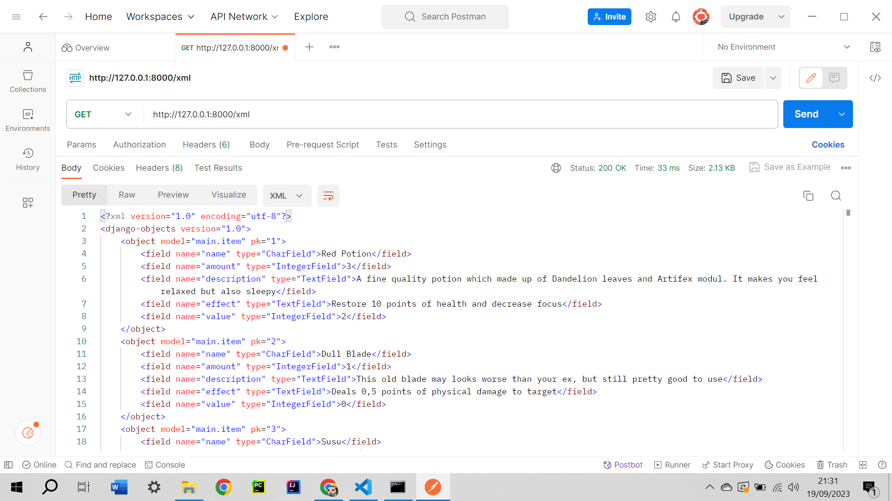
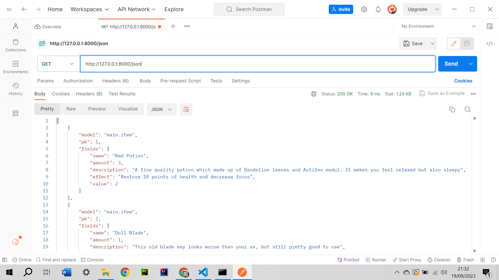
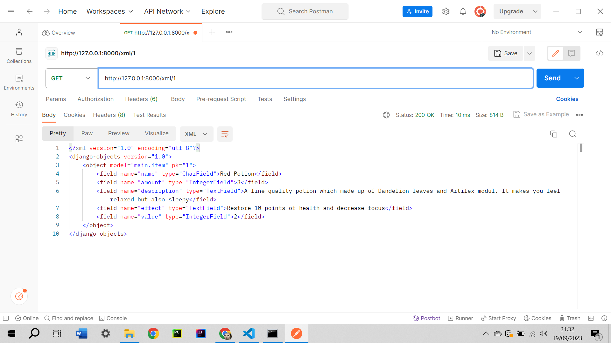
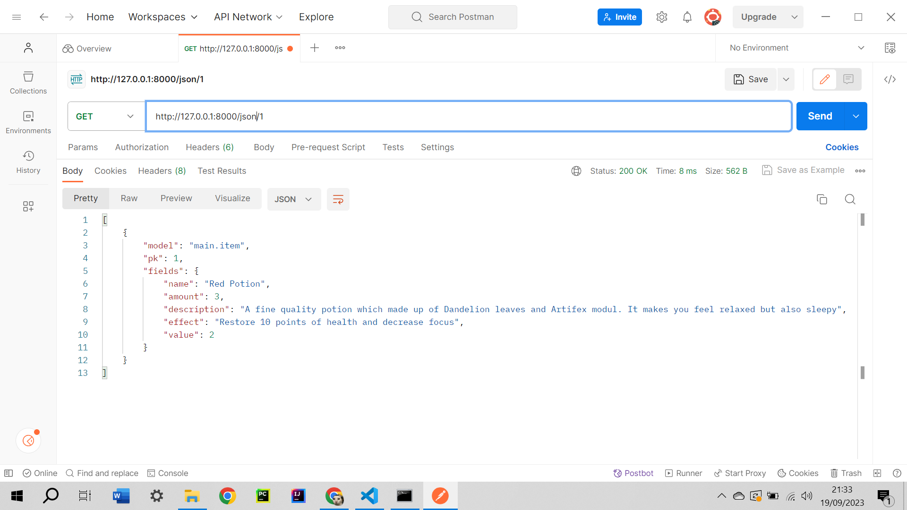

Tautan Adaptable:
https://inventorybeta.adaptable.app/

TUGAS 2
1. Pertama-tama, kita harus membuat proyek dimana app kita yang bernama main berada. Dalam hal ini, saya menamai proyek sata sebagai InventoryBeta dan kemudian saya hubungkan ke repository github. Setelah tercipta project nya, kita jalankan startapp main untuk membuat app bernama main. Jangan lupa, kita harus menambahkan main pada INSTALLED APPS yang ada di settings.py proyek InventoryBeta. Hal ini bertujuan agar Django mengenali bahwa main merupakan app yang bisa dijalankan. Setelah itu, kita isi models.py dengan Class Item dan atribut-atributnya sesuai yang di ketentuan. Setelah model selesai dibuat, saya terlebih dahulu membuat folder template serta membuat file home.html, agar ketika membuat fungsi di views.py, kita sudah tau file html mana yang mau ditampilkan. Setelah membuat file html nya, saya membuat fungsi home yang digunakan untuk me-render file home.html yang nantinya akan digunakan untuk menampilkan data model kita. Setelah menyelesaikan views, kita isi urls.py yang ada di InventoryBeta supaya kita bisa mengatur rute url agar spesifik ke aplikasi main kita. Disini saya men-setting, jika url nya string kosong, maka langsung jalankan url milik app main agar tidak perlu memasukkan /main lagi. Barulah setelah itu kita mengisi urls.py yang ada di main. Saya setting agar jika kita memasukkan url kosong, maka jalankan fungsi home yang ada di views.py agar secara default, app main akan menampilkan home.html yang adalah tampilan data kita. Terakhir, kita tinggal commit dan push ke github, setelah itu deploy ke Adaptable. Saya juga menambahkan test case untuk model dimana isinya adalah mengecek apakah field dan atribut model Item kita yang diinput dan yang tersimpan sudah benar, serta apakah field name nya sudah sesuai maksimal karakter yang diberikan. 

2. !(Screenshot (1263).png)

3. Virtual environment berfungsi supaya aplikasi dan segala hal yang berhubungan dengan proyek django kita tidak bentrok dengan python dan django versi lainnya yang mungkin saja terinstall di komputer kita yang mungkin saja bisa menyebabkan masalah. Kita bisa saja tidak menggunakan virtual environment untuk project django, tetapi seperti poin diatas, bisa menyebabkan bentrok dengan python atau django versi lain yang terinstall di komputer.

4.
MVT adalah Model View Template, yaitu suatu arsitektur untuk menampilkan web, aplikasi, atau    User Interface lain. Perbedaannya dengan MVC adalah di bagian Template. Template disini adalah kode HTML yang akan befungsi untuk menampilkan respons dari request HTTP client. Model dan View pada MVT akan di-manage atau dijembatani oleh framework.

MVC adalah Model View Controller. Pada MVC, Controller akan berfungsi sebagai jembatan bagi
Model dan View. Controller ini yang akan memerintahkan Model untuk meng-update kondisinya jika ada perubahan serta memerintahkan View untuk menampilkan ke user ataupun mengubah tampilannya jika ada perubahan juga. Hal ini berbeda dengan MVT dimana Template lah yang akan memberikan tampilan ke Client, sementara yang menjadi jembatan antara Model dan View adalah framework.

MVVM adalah Model-View-ViewModel. Pada MVVM, yang menjadi jembatan antar Model dan View adalah Model-View. Model-View ini merupakan tempat dimana function, command, serta method dituliskan untuk membantu menampilkan isi dan kondisi dari View, sekaligus menjadi tempat pengoperasian model kita. Hal ini berbeda dengan MVT yang menggunakan framework, atau MVC yang menggunakan Controller

TUGAS 2
1. Untuk POST, nama variabel atau value nya tidak ditampilkan di url sehingga relatif lebih aman, serta tidak ada batas panjang value karakter yang ingin diberikan. Untuk GET, nama variabel atau value akan ditampilkan di url serta batas panjang value yang akan diberikan adalah 255 karakter. POST juga men-support berbagai jenis data seperti String, Integer, Binary, dll, sedangkan GET hanya support String.

2. HTML digunakan untuk menampilkan data dalam bentuk yang interaktif, menarik, serta enak untuk dilihat oleh orang secara umum. XML dan JSON digunakan untuk menyimpan dan mentransmisikan data antar app. Perbedaan antar XML dan JSON adalah di bagian tampilan kode nya. XML akan menyimpan data dalam bentuk tag, mirip seperti kode pada HTML. JSON akan menyimpan objek data dalam bentuk teks yang mudah untuk dibaca. Objek pada JSON akan disimpan dalam bentuk key dan value, mirip seperti dictionary pada python.

3. Alasan utamanya adalah, format JSON adalah bentuk teks, sehingga kode untuk membaca dan membuat JSON banyak tersedia di berbagai bahasa pemrograman. Selain sifatnya yang universal karena dapat dioperasikan di banyak bahasa pemrograman, isi dari file JSON juga mudah untuk dibaca oleh manusia karena tidak serumit XML. 

4. Pertama-tama, kita buat dulu file forms.py yang akan kita gunakan sebagai struktur form untuk menginput item baru. Pada file tersebut, kita buat class bernama ItemForm sebagai class form khusus untuk model class Item. Selanjutnya kita buat file html bernama create_product.html, dimana file tersebut akan menampilkan parameter model Item kita, sebuah box kosong untuk mengisi parameter tersebut, serta tombol submit untuk menyimpan item yang dia buat. Setelah file untuk menampilkan form nya jadi, kita tambahkan fungsi create_product pada views.py yang nantinya akan bertugas untuk me-render create_product.html, memvalidasi input dari form tadi, serta menyimpan data dari form tersebut. Kemudian untuk mengerjakan bonus,  saya memanfaatkan Item.objects.count, dimana method ini akan menampilkan berapa banyak objek dari model Item yang tersimpan di app kita. Dan juga karena setiap objek punya amount, saya memanfaatkan Item.objects.all yang dimana method ini akan me return seluruh objek dari model Item yang tersimpan, kemudian kita iterasikan seluruh objek yang ada di sana dan ambil value dari parameter 'amount' yang ada di masing-masing objek untuk mendapatkan total amount dari seluruh objek Item yang ada. Kemudian kita tambahkan button di home.html, yang mana jika button tersebut ditekan, user akan otomatis di direct ke url 'create_product/' untuk mengisi form. Tak lupa juga saya tambahkan jumlah item serta total amount ke home.html juga. Selanjutnya kita setting urls.py yang ada di folder main, supaya jika kita memasukkan url 'create_product/', ia akan menjalankan fungsi create_product yang ada di views.py supaya menampilkan halaman pengisian form. Selanjutnya kita membuat fungsi show_xml pada views.py, kita ambil seluruh objek Item yang tersimpan dengan cara Item.objects.all dan kita manfaatkan method serializer untuk mentranslate objek-objek Item yang tersimpan di data kita menjadi bentuk file xml. Hal yang sama juga kita lakukan untuk file JSON. Kita buat fungsi show_json dan kita gunakan method serializer untuk mentranslate objek yang tersimpan menjadi bentuk file JSON. Kemudian kita setting lagi ke urls.py, jika kita memasukkan url 'xml/', app akan memanggil method show_xml untuk menampilkan file xml kita, tak lupa juga jika kita memasukkan url 'json', app akan menampilkan file JSON. Kemudian kita juga ingin menampilkan file XML dan JSON tetapi hanya untuk objek dengan id tertentu. Kita bisa buat method show_xml_by_id serta show_json_by_id dan manfaatkan method objects.filter(pk) dan kembali gunakan serializer untuk mentranslate nya menjadi bentuk xml dan json. Perbedaan dengan show_xml atau show_json hanyalah di bagian Item.objects.all yang mana method tersebut akan mereturn semua objek Item yang tersimpan, sedangkan Item.objects.filter(pk) hanya akan me return objek Item dengan id yang kita inginkan saja. Terakhir, kita kembali tambahkan url 'xml/<int:id>/' dan url 'json/<int:id>/ agar jika kita memasukkan url tersebut, app secara otomatis akan menampilkan file xml atau json dari id yang kita inginkan.

5. 

TUGAS 4

1. Django UserCreationForm merupakan form build in dari django yang langsung memungkinkan kita membuat user dengan memasukkan username dan password tanpa perlu menulis kode form dari awal lagi. Keuntungannya tentu saja kita hanya perlu import form tersebut saja dan langsung bisa kita pakai, tidak perlu membuat object form lagi kemudian kita tulis sedemikian rupa supaya bisa menyimpan username dan password. Kekurangannya adalah UserCreationForm hanya bisa digunakan untuk menyimpan username dan password, kita tidak bisa menyimpan email untuk verifikasi, ataupun nomor telepon

2. Otentikasi adalah mem-verify siapa user yang berusaha login. Biasanya dengan mengecek apakah username yang diinput ada, jika ada, dicek lagi apakah password yang diinput itu benar milik username yang bersangkutan. Otorisasi adalah mengecek apa saja yang bisa dan tidak bisa dilakukan oleh orang yang berhasil di otentikasi. Misalnya user umum hanya bisa mengakses bagian tertentu dari website dan kemampuan yang bisa dilakukan terbatas, berbeda dengan admin yang lebih leluasa. Keduanya penting untuk menjaga agar website senantiasa terkontrol dengan membatasi siapa saja yang bisa masuk dan apa saja yang bisa dan tidak bisa dilakukan oleh user yang masuk

3. Cookies merupakan informasi atau data yang akan disimpan di browser milik user/client. Ketika web server berinteraksi dengan banyak web browser, web server perlu mengidentifikasi request mana yang datang dari web browser mana. 

4. Cookies bisa saja diretas dan diambil informasi-informasi yang tersimpan disana, khususnya jika cookies sehabis dari login suatu akun. Jika cookies tidak dihapus secara berkala, bisa saja menumpuk di memori dan mengurangi performan, khususnya pada device yang tua

5.
Pertama-tama kita membuat fungsi untuk register yang bertugas untuk membuat user baru dengan memanfaatkan UserCreationForm dan buat juga file register.html. Fungsi register tersebut akan meminta input username dan password, dan akan menyimpan user yang baru jika username yang diinput belum ada yang pernah pakai. Fungsi tersebut juga akan menampilkan pesan "
Pertama-tama kita membuat fungsi untuk register yang bertugas untuk membuat user baru dengan memanfaatkan UserCreationForm dan buat juga file register.html. Fungsi register tersebut akan meminta input username dan password, dan akan menyimpan user yang baru jika username yang diinput belum ada yang pernah pakai. Fungsi tersebut juga akan menampilkan pesan "Your account has been successfully created!" apabila kita berhasil menyimpan user baru. Fungsi tersebut kemudian kita render ke file register.html yang tadi kita buat, akan form nya bisa ditampilkan. Tak lupa kita tambahkan path "register/" di urls.py agar bisa men-direct ke halaman register. Kemudian kita buat fungsi login dan juga file login.html. Method login tersebut akan meminta input username dan password kemudian melakukan otentikasi user. Jika berhasil, maka program akan men-direct ke halaman utama, jika tidak, maka akan menampilkan 'Sorry, incorrect username or password. Please try again.'. Kemudian, fungsi login tersebut kita render ke file login.html yang tadi dibuat supaya bisa menampilkan halaman login. Di file login.html juga kita buat button yang akan men-direct ke halaman register jika user belum punya akun. Tak lupa juga kita harus menambahkan path "login/" di urls.py. Selanjutnya kita juga buat fungsi logout yang akan bertugas menghapus sesi login pengguna yang saat ini masuk, kemudian akan men-direct kembali ke halaman login. Jangan lupa kita tambahkan path(logout/) supaya kita bisa mengakses url fungsi logout. Terakhir tinggal kita buat button di file home.html yang akan men direct ke fungsi logout jika diklik. Kemudian kita juga akan me restriksi halaman home dengan @login_required(login_url='/login') yang akan mengharuskan user untuk logim terlebih dahulu sebelum masuk ke halaman utama. Kemudian kita juga bisa mengimplementasikan cookie untuk memanfaatkan session id kita seperti kita login jam berapa, dan username siapa yang sedang login. Untuk menampilkan last login kita, kita bisa set cookie di fungsi login dengan nama last_login yang isinya adalah string datetime.datetime.now() yang akan menampilkan pukul berapa kita terakhir kali melakukan login. kemudian untuk menampilkannya di halaman utama, kita tinggal tambahkan saja 'last_login': request.COOKIES['last_login'] di fungsi home kita. Kemudian kita juga set agar setiap logout, kita akan menghapus cookie login kita dengan menggunakan response.delete_cookie('last_login'). Kemudian kita bisa menampilkan value dari last_login di home.html yang isinya adalah waktu terakhir kita login. Terakhir kita akan mengasosiasikan user dengan model yang sudah dibuatnya, agar setiap user hanya bisa melihat model yang ia buat sendiri. Kita tambahkan field user pada models.py dan kita isi dengan models.ForeignKey, hal tersebut untuk mengasosiasikan suatu model dengan user tertentu. Kemudian kita tambahkan product = form.save(commit=False) yang bertujuan agar django tidak langsung menyimpan objek yang dibuat dari form ke database supaya kita bisa mendapatkan username dari yang membuat objek tersebut. Kemudian tinggal tambahkan username yang bersangkutan ke home.html. Langkah terakhir tinggal lakukan migrate supaya perubahan yang kita buat pada models.py tersimpan. Kemudian untuk menambahkan amount dari object Item sebanyak 1, kita membuat fungsi yang akan menerima id objek sebagai parameter, disini fungsitersebut saya namakan increement_amount , kemudian kita gunakan Item.objects.get(pk=id) untuk mendapatkan objek dengan id tersebut dan assign ke variabel dengan nama updated_item. Kemudian kita gunakan updated_item.amount += 1 yang akan menambahkan value dari amount pada objek tersebut sebanyak 1 kemudian kita save dengan menjalankan updated_item.save(), dan terakhir kita jalankan HttpResponseRedirect(reverse('main:home')) yang akan langsung me-redirect kembali ke halaman secara real time (tak perlu refresh) dan langsung meng-update amount yang baru. Kemudian kita tambahkan path(increement_amount<int:id>/) supaya kita bisa assign url fungsi tadi ke suatu button. Terakhir tinggal tambahkan saja button yang jika diklik akan memanggil url tadi beserta id objek yang dia reference. Hal yang sama berlaku untuk mengurangi amount, kita buat fungsi yang menerima objek id sebagai parameter, fungsi yang saya buat bernama decreement_amount, tetapi untuk decreement saya tambahkan kondisi jika amount suatu objek sudah 0, dia tidak akan menguranginya lagi melainkan akan menampilkan error message bahwa amount sudah 0, jika amount > 0 barulah dia akan mengurangi. Setelah mengurangi amount kita save juga kemudian kembali direct ke halaman home. Tak lupa juga tambahkan path(decreement_amount<int:id>/) dan assign url tersebut ke button. Kemudian untuk delete item juga sama saja seperti tadi, kita buat fungsi yang menerima objek id, saya namakan delete_item. Kemudian ambil objeknya dengan Item.objects.get(pk=id) dan saya simpan ke variable deleted_item. Kemudian tinggal jalanakan deleted_item.delete() untuk menghapus item tersebut, kemudian kita direct kembali ke halaman home. Tak lupa tambahkan path('delete_item/<int:id>') dan assign url tersebut ke button

